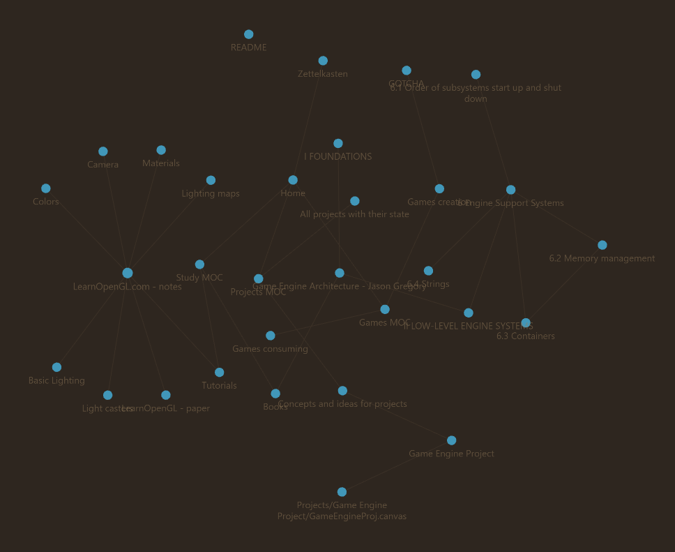

Hi, these are my Notes. 
Provided mostly for me to quickly sync everything between my devices, although you can use it freely for learning or reference to some sources.
I want to provide everything I am studying or working on here to keep an eye on those things. Some on them may be considered not necessary for public eyes, but as mentioned before, these are provided mostly for quick sync
  
State of the map, on 05.03.2025

## Best way to view notes:
Just use Obsidian app, and fork this repo, use it as an vault in the app :)

## Contribution
If you will see any false information in notes I provided, send me PR to fix this. I would be honored!
